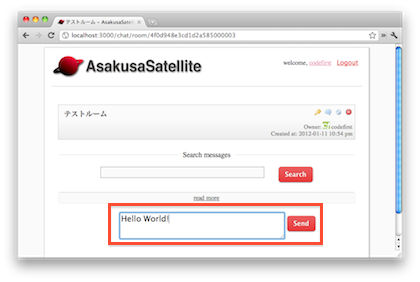
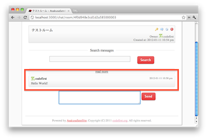

基本機能
=======================
部屋作成
-----------------------
1. トップページで Create New Room ボタンをクリックします

.. image:: images/create_new_room_top.png

2. 部屋名を入力し、Create ボタンをクリックします。

.. image:: images/create_new_room.png

3. 部屋が作成されます。

.. image:: images/new_room.png

チャット
-----------------------
1. トップページで部屋を選択します

.. image:: images/top.png

2. 一番下のテキストボックスに発言内容を記入し、Sendボタンをクリックします。

3. 発言内容が末尾に追加され、他の閲覧者に通知されます。

ファイルアップロード
-----------------------

TODO

デスクトップ通知
-----------------------

TODO

全文検索
-----------------------

TODO

