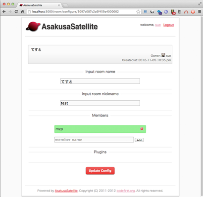
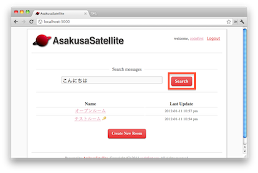

基本機能
=======================
部屋作成
-----------------------
1. トップページで **Create New Room** ボタンをクリックします

.. image:: images/create_new_room_top.png

2. 部屋名を入力し、 **Create** ボタンをクリックします。 このとき **public room** のチェックをはずすと、参加者のみに公開される非公開部屋を作成できます。 参加者の追加・削除は部屋の設定画面から行なえます。

.. image:: images/create_new_room.png

3. 部屋が作成されます。

.. image:: images/new_room.png

作成した部屋を削除するためには、部屋を表示し、
部屋名の右にある削除アイコンをクリックします。

.. _room-conf:

部屋の設定変更
-----------------------
部屋の設定を変更するためには、部屋を表示し、
部屋名の右にある設定アイコンをクリックします。

設定項目は以下の通りです。

* **部屋名** (必須):
  部屋の名称を指定します。

* **ニックネーム** (任意、0.8.1 以降):
  部屋のニックネームを指定します。ニックネームにはアルファベットおよび "-", "_" が使用できます。
    * ニックネームを指定しない場合: 部屋へのリンクが http://hostname/chat/room/<ID> となります
    * ニックネームを指定した場合: 部屋へのリンクが http://hostname/chat/room/<ニックネーム> となります

* **メンバー** (秘密の部屋の場合):
  この部屋に参加できるメンバを指定します。

設定変更後、 **Update Config** ボタンをクリックすることで、設定が保存されます。

また画面の下半分はプラグインの設定画面へのリンクです。
**Configuration** リンクをクリックすることで、プラグインの設定ページに移動できます。

チャット
-----------------------
1. トップページで部屋を選択します

2. 一番下のテキストボックスに発言内容を記入し、 **Send** ボタンをクリックします。

.. image:: images/room.png

3. 発言内容が末尾に追加され、他の閲覧者に通知されます。

.. image:: images/message.png

ブラウザがチャットサーバに正しく接続できているかは
アイコンの表示で確認できます。
削除ボタンのアイコンに×マークが表示されている場合には
正しく接続できていないため、
インストールが正しく行われているかを確認してください。

マウスポインタを発言の上にかざすと
その発言を編集するボタンが表示されます。

左から順に以下の意味を持っています。

1. Redmine チケット作成ボタン(プラグイン)
2. 発言編集ボタン
3. 発言削除ボタン

自分以外のユーザのメッセージは編集と削除ができないため、
Redmine チケット作成ボタンのみが表示されます。

ファイルアップロード
-----------------------
1. メッセージ領域にファイルをドラッグ＆ドロップします。

.. image:: images/drag_image.png

2. ファイルがアップロードされ、そのファイルへのリンクを表示します。
ドラッグしたファイルが画像の場合、その画像を表示します。

.. image:: images/image_added.png

デスクトップ通知
-----------------------
閲覧中の部屋で自分以外のメッセージが投稿された場合に、
デスクトップに通知します。

.. image:: images/ss_realtime.png

デスクトップ通知を有効にするには、設定を行う必要があります。
画面右上のログインユーザのリンクをクリックし、個人設定画面を開きます。
**Desktop Notification On** をクリックし、
その後、 **許可** をクリックしてください。

.. image:: images/notification_config.png

許可を解除するためには、Google Chrome のアドレスバーに

chrome://settings/contentExceptions#notifications

と入力し、設定を行ってください。

全文検索
-----------------------
1. トップページの検索ボックスに探したい単語を入力し、 **Search** ボタンをクリックします。

2. 検索結果が表示されます。検索結果の近くの発言を閲覧する場合は日付をクリックします。

3. 検索結果の前後の発言を表示します。

