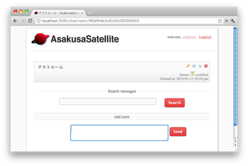
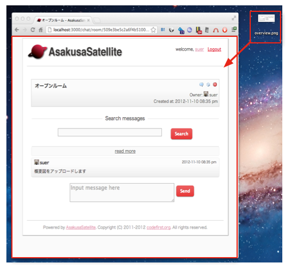
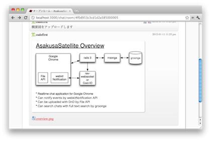

基本機能
=======================
部屋作成
-----------------------
1. トップページで Create New Room ボタンをクリックします

2. 部屋名を入力し、Create ボタンをクリックします。

.. image:: images/create_new_room.png

3. 部屋が作成されます。

チャット
-----------------------
1. トップページで部屋を選択します

.. image:: images/top.png

2. 一番下のテキストボックスに発言内容を記入し、Sendボタンをクリックします。

.. image:: images/room.png

3. 発言内容が末尾に追加され、他の閲覧者に通知されます。

.. image:: images/message.png

ファイルアップロード
-----------------------
1. メッセージ領域にファイルをドラッグ＆ドロップします。

2. ファイルがアップロードされ、そのファイルへのリンクを表示します。
ドラッグしたファイルが画像の場合、その画像を表示します。

デスクトップ通知
-----------------------
閲覧中の部屋で自分以外のメッセージが投稿された場合はデスクトップに
通知します。ブラウザによってはデスクトップへの通知を許可する設定が必要となります。

.. image:: images/ss_realtime.png

全文検索
-----------------------

TODO

