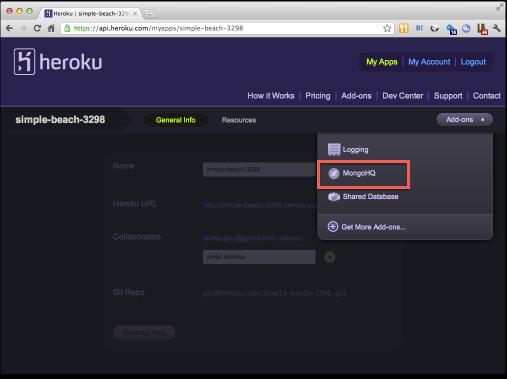
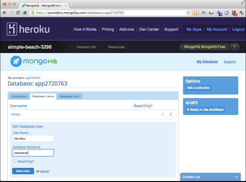
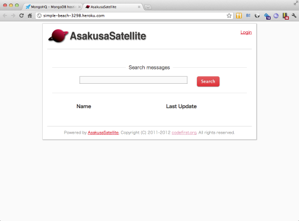

heroku へのデプロイ
=============================
AsakusaSatellite は heroku 上で動作させることができます。
以下、heroku へのデプロイの手順について説明します。

なお、手順では以下を前提とします。
* heroku gem および git がインストールされている
* heroku のアカウントを持っている
* 

1. `githubのページ <https://github.com/codefirst/AsakusaSatellite>`_ から最新の ZIP をダウンロードし展開します。

2. AsakusaSatellite を git の管理下に置きます。

AsakusaSatellite のトップディレクトリにて以下のコマンドを発行します。

::

    $ git init
    $ git add .
    $ git commit -a -m "heroku"
    
3. heroku にアプリケーションを作成します。

AsakusaSatellite のトップディレクトリにて以下のコマンドを発行します。

::

    $ heroku create
    Creating simple-beach-3298... done, stack is bamboo-mri-1.9.2
    http://simple-beach-3298.heroku.com/ | git@heroku.com:simple-beach-3298.git
    Git remote heroku added
    
4. mongoDB Add-on を追加します。

::

    $ heroku addons:add mongohq:free

5. mongoDB のパスワードを設定します。

作成したアプリケーションの管理ページの Add-ons より MongoHQ を選択します。

データベース名(appXXXXXXX) を確認します。
また、Database Users タブを開くと、初期ユーザとして heroku が登録されているので、
パスワードを適宜設定します。

6. config/mongoid.yml を編集します。

production 環境の項目に、確認したデータベース名および設定した heroku ユーザのパスワードなどを設定します。

::

    production:
      host: staff.mongohq.com
      port: 10060
      username: heroku
      password: password
      database: app2720763

編集内容を commit します。

::

    $ git commit -a -m "db settings"

7. heroku へデプロイします。

::

    $ git push heroku master

8. デプロイが完了したアプリケーションにアクセスします。

::

    $ heroku open 

