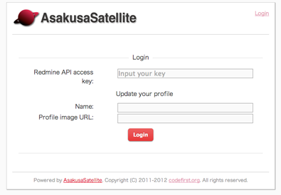

プラグイン
=======================
Redmine 連携
-----------------------
機能
^^^^^^^^^^^^^^^^^^^^^^^
**#数字** を Redmine のチケットへのリンクに変換します。
API アクセスキーが設定されている場合は、チケットの名前を自動で付加します。
また、メッセージの内容を Redmine に投稿するためのリンクを各メッセージに付加します。

設定
^^^^^^^^^^^^^^^^^^^^^^^
config/filter\_intra.yml に以下を記述します

.. code-block:: ruby

  - name: redmine_ticket_link

また部屋の設定画面からRedmineのルートURL、APIアクセスキー、チケットを作成するプロジェクトを指定できます。
APIアクセスキーはRedmineの"個人設定 > API アクセスキー"から確認できます。

.. image:: images/redmine_config.png

.. _graphviz:

コードハイライト
-----------------------
機能
^^^^^^^^^^^^^^^^^^^^^^^
ソースコードをハイライトします。
記法は

* １行目に **言語\:\:**
* ２行目以降に **ソースコード** を記述します。

例えば,

.. code-block:: ruby

  ruby::
  puts "Hello World!"

と記述することで、２行目がハイライトして表示されます。

また、Graphviz の dot 記法もサポートしています。

.. code-block:: ruby

  graphviz::
  digraph{A->B->C->A}

のように、 **graphviz::** に続けて dot 記法を記述することで
簡単なグラフを描画することができます。

設定
^^^^^^^^^^^^^^^^^^^^^^^
config/filter\_intra.yml に以下を記述します

.. code-block:: ruby

  - name: code_highlight_filter

汎用リンク
-----------------------
機能
^^^^^^^^^^^^^^^^^^^^^^^
http:// https:// で始まるURLをリンクに変換します。また、
以下のサイトは画像として展開します。

* twitpic.com
* f.hatena.ne.jp
* movapic.com
* yflog.com
* ow.ly
* youtu.be
* img.ly
* www.nicovideo.jp
* plixi.com
* dl.dropbox.com
* gyazo.com
* instagr.am
* .jpg, .jpeg, .png, .gif で終わる URL (case insensitive)

設定
^^^^^^^^^^^^^^^^^^^^^^^
config/filter\_intra.yml に以下を記述します

.. code-block:: ruby

  - name: auto_link

Twitter リンク
-----------------------
機能
^^^^^^^^^^^^^^^^^^^^^^^
メッセージ中の **@username** をTwitterアカウントへのリンクに変換します。

設定
^^^^^^^^^^^^^^^^^^^^^^^
config/filter\_intra.yml に以下を記述します

.. code-block:: ruby

  - name: twitter_link

.. _localauth:

QuoteItプラグイン
------------------------------
機能
^^^^^^^^^^^^^^^^^^^^^^^
メッセージ中のURLを `QuoteIt <http://quoteit.heroku.com>`_ を用いて展開します。
各種画像サービス、Twitter、Slideshare等の展開ができます。

展開可能なサイトの一覧は `こちら <http://quoteit.heroku.com/plugins>`_ を参照してください。

設定
^^^^^^^^^^^^^^^^^^^^^^^
config/filter\_intra.yml に以下を記述します

.. code-block:: ruby

  - name: quote_it

絵文字プラグイン
-----------------------------

機能
^^^^^^^^^^^^^^^^^^^^^^^
メッセージ中の :絵文字名: を画像として展開します。

設定
^^^^^^^^^^^^^^^^^^^^^^^
config/filter\_intra.yml に以下を記述します

.. code-block:: ruby

  - name: emoji_filter

展開される画像は、環境変数 AS_EMOJI_URL_ROOT を使用して $AS_EMOJI_URL_ROOT/絵文字名.png として展開されます。

AsakusaSatellite に同梱する場合は以下の手順で画像ファイルを配備します。

1. <AS_ROOT>/public/emoji に画像ファイルを、拡張子を .png として格納します
2. 環境変数 AS_EMOJI_URL_ROOT に http(s)://as.root.url/emoji を指定して AsakusaSatellite を起動します

上記のように設定した場合、メッセージ中に :xxx: と記述した場合 http(s)://as.root.url/emoji/xxx.png を展開して表示します。

動作確認が目的の場合は以下の2つの URL を指定できます。

* http://www.emoji-cheat-sheet.com/graphics/emojis/
* http://assets.github.com/images/icons/emoji/

上記 URL を指定した場合、メッセージ中に :smile: と記述した場合、http://www.emoji-cheat-sheet.com/graphics/emojis/smile.png と展開され、以下のように画像を表示します。

.. image:: http://www.emoji-cheat-sheet.com/graphics/emojis/smile.png
   :width: 16px

emoticon プラグイン
-----------------------------

機能
^^^^^^^^^^^^^^^^^^^^^^^
ルールベースでメッセージの変換を定義し、画像として展開します。

設定
^^^^^^^^^^^^^^^^^^^^^^^
1. config/filter\_intra.yml に以下を記述します

.. code-block:: ruby

  - name: emoticon_filter

2. plugins/as_emoticon_filter/rule.yml を編集し、変換ルールを作成します。

3. <AS_ROOT>/public/emoticons に rule.yml で指定したファイル名で emiticon ファイルを保存します。

rule.yml は yaml 形式でキーにメッセージの変換対象、値に変換後に表示するファイル名を記述します。

例えば、rule.yml に

.. code-block:: ruby

  - (test): test.gif

と記述した場合は <AS_ROOT>/public/emoticons/test.gif に画像ファイルを保存し、メッセージ中に (test) と記述することで画像が展開されます。

ローカル認証
-----------------------
機能
^^^^^^^^^^^^^^^^^^^^^^^
AsakusaSatellite は Twitter の OAuth を用いて認証を行いますが、
本プラグインを有効にすると、ローカルのユーザリストを用いた認証に切り替えます。

設定
^^^^^^^^^^^^^^^^^^^^^^^
<AS_ROOT>/config/settings.yml に以下を記述します。(0.8.1 以降)
本設定を行うことにより、Twitter の OAuth による認証は無効になり、
ローカル認証が有効になります。

.. code-block:: ruby

  omniauth:
    provider: "local"

次に、ユーザリストにユーザを追加します。
ユーザリストは以下のファイルです。

  <AS_ROOT>/plugins/as_localauth_plugin/config/users.yml

内容は以下の形式です。

.. code-block:: ruby

  testuser1:
    screen_name: Test User1
    password: b444ac06613fc8d63795be9ad0beaf55011936ac
    profile_image_url: http://example.com/test1_user.png

ユーザリストは YAML 形式で記述します。

**testuser1 の部分** にはユーザ ID を記述します。

**screen_name** はユーザの表示名を記述します。

**password** にはパスワードの SHA-1 ハッシュを記述します。
SHA-1 ハッシュの生成は、以下のコマンドで行うことができます。

.. code-block:: sh

  $ ruby <AS_ROOT>/plugins/as_localauth_plugin/script/gen_sha1 <PASSWORD>

**profile_image_url** にはユーザのアイコンの URL を記述します。
データ URI スキームも指定することもできます。
testuser2 の例を参考にしてください。

Redmine API アクセスキー認証
--------------------------------
機能
^^^^^^^^^^^^^^^^^^^^^^^
AsakusaSatellite の認証を Redmine の API アクセスキーによる認証に切り替えます。

設定
^^^^^^^^^^^^^^^^^^^^^^^
<AS_ROOT>/config/settings.yml に以下を記述します。(0.8.1 以降)

.. code-block:: ruby

  omniauth:
    provider: 'redmine'
    provider_args:
      - 'Redmine の URL'

使用方法
^^^^^^^^^^^^^^^^^^^^^^^
1. 「ログイン」リンクをクリックします。
2. 以下の情報を入力します
  * RedmineのAPIアクセスキー
  * AsakusaSatellite で使用するユーザ名
  * AsakusaSatellite で使用する画像の URL
3. ログインボタンをクリックします。

private な部屋に追加するときの注意点
^^^^^^^^^^^^^^^^^^^^^^^^^^^^^^^^^^^^^^^^^^^^^^^^^^^^^^
このプラグインで認証されたユーザは、ユーザ ID として Redmine のユーザの **メールアドレス** が保存されます。
したがって、private に設定された部屋にこのプラグインで認証されたユーザを追加する場合は、Redmine のユーザの **メールアドレス** を指定する必要があります。

.. _watage:

Watage プラグイン
------------------------------------------------------

機能
^^^^^^^^^^^^^^^^^^^^^^^^^^^^^^^^^^^^^^^^^^^^^^^^^^^^^^

`Watage <https://github.com/codefirst/watage>`_ を利用し、添付ファイルをDropboxなどのクラウドストレージ上に保存するようにします。

設定
^^^^^^^^^^^^^^^^^^^^^^^^^^^^^^^^^^^^^^^^^^^^^^^^^^^^^^

config/filter\_intra.yml に以下を記述します

.. code-block:: ruby

  some mallowlabs coool configure file format

token/secret tokenをWatageから取得した上で、config/settings.yml に以下を記述します。

.. code-block:: ruby

  attachment_policy: watage
  attachment_path: <WatageのURL(例: http://watage.examlpe.com/)>
  watage_token: <your watage token>
  watage_token_secret: <your watage token secret>

