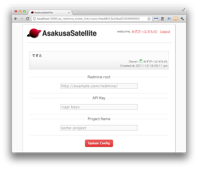

プラグイン
=======================
Redmine 連携
-----------------------
機能
^^^^^^^^^^^^^^^^^^^^^^^
**#数字** を Redmine のチケットへのリンクに変換します。
API アクセスキーが設定されている場合は、チケットの名前を自動で付加します。
また、メッセージの内容を Redmine に投稿するためのリンクを各メッセージに付加します。

設定
^^^^^^^^^^^^^^^^^^^^^^^
config/filter.yml に以下を記述します

.. code-block:: ruby

  - name: redmine_ticket_link
    roots: "Redmine のルート URL"
    api_key: "Redmine の個人設定 > API アクセスキー"

また部屋の設定画面からチケットを作成するプロジェクトを指定できます。

.. _graphviz:

コードハイライト
-----------------------
機能
^^^^^^^^^^^^^^^^^^^^^^^
ソースコードをハイライトします。
記法は

* １行目に **言語\:\:**
* ２行目以降に **ソースコード** を記述します。

例えば,

.. code-block:: ruby

  ruby::
  puts "Hello World!"

と記述することで、２行目がハイライトして表示されます。

また、Graphviz の dot 記法もサポートしています。

.. code-block:: ruby

  graphviz::
  digraph{A->B->C->A}

のように、 **graphviz::** に続けて dot 記法を記述することで
簡単なグラフを描画することができます。

設定
^^^^^^^^^^^^^^^^^^^^^^^
config/filter.yml に以下を記述します

.. code-block:: ruby

  - name: code_highlight_filter

汎用リンク
-----------------------
機能
^^^^^^^^^^^^^^^^^^^^^^^
http:// https:// で始まるURLをリンクに変換します。また、
以下のサイトは画像として展開します。

* twitpic.com
* f.hatena.ne.jp
* movapic.com
* yflog.com
* ow.ly
* youtu.be
* img.ly
* plixi.com

設定
^^^^^^^^^^^^^^^^^^^^^^^
config/filter.yml に以下を記述します

.. code-block:: ruby

  - name: auto_link

Twitter リンク
-----------------------
機能
^^^^^^^^^^^^^^^^^^^^^^^
メッセージ中の **@username** をTwitterアカウントへのリンクに変換します。

設定
^^^^^^^^^^^^^^^^^^^^^^^
config/filter.yml に以下を記述します

.. code-block:: ruby

  - name: twitter_link

Jenkins リンク
-----------------------
機能
^^^^^^^^^^^^^^^^^^^^^^^
メッセージ中の **::jenkins:{Job名}:{Job番号}** を Jenkins へのリンクに変換します。

設定
^^^^^^^^^^^^^^^^^^^^^^^
config/filter.yml に以下を記述します

.. code-block:: ruby

  - name: jenkins_filter
    roots: "Jenkins の URL"

.. _localauth:

ローカル認証
-----------------------
機能
^^^^^^^^^^^^^^^^^^^^^^^
AsakusaSatellite は Twitter の OAuth を用いて認証を行いますが、
本プラグインを有効にすると、ローカルのユーザリストを用いた認証に切り替えます。

設定
^^^^^^^^^^^^^^^^^^^^^^^
<AS_ROOT>/config/settings.yml に以下を記述します。
本設定を行うことにより、Twitter の OAuth による認証は無効になり、
ローカル認証が有効になります。

.. code-block:: ruby

  login_link: http://hostname:3000/localauth/login

次に、ユーザリストにユーザを追加します。
ユーザリストは以下のファイルです。

  <AS_ROOT>/vendor/plugins/as_localauth_plugin/config/users.yml

内容は以下の形式です。

.. code-block:: ruby

  testuser1:
    screen_name: Test User1
    password: b444ac06613fc8d63795be9ad0beaf55011936ac
    profile_image_url: http://example.com/test1_user.png

ユーザリストは YAML 形式で記述します。

**testuser1 の部分** にはユーザ ID を記述します。

**screen_name** はユーザの表示名を記述します。

**password** にはパスワードの SHA-1 ハッシュを記述します。
SHA-1 ハッシュの生成は、以下のコマンドで行うことができます。

.. code-block:: sh

  $ ruby <AS_ROOT>/vendor/plugins/as_localauth_plugin/script/gen_sha1 <PASSWORD>

**profile_image_url** にはユーザのアイコンの URL を記述します。
データ URI スキームも指定することもできます。
testuser2 の例を参考にしてください。
